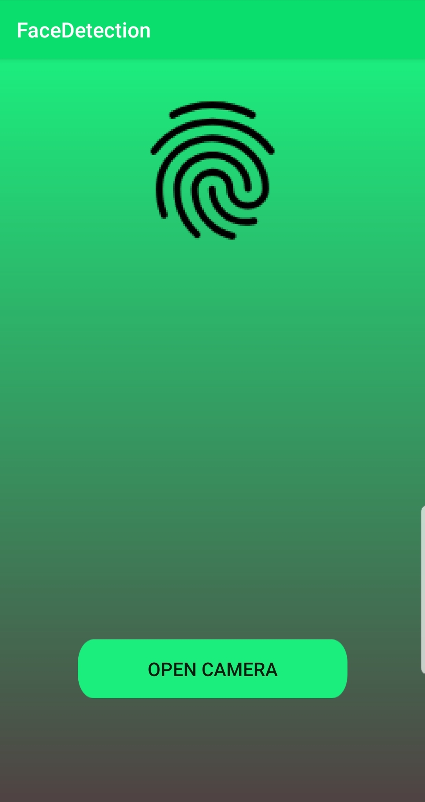
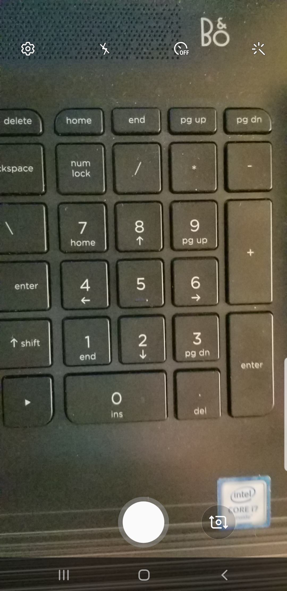
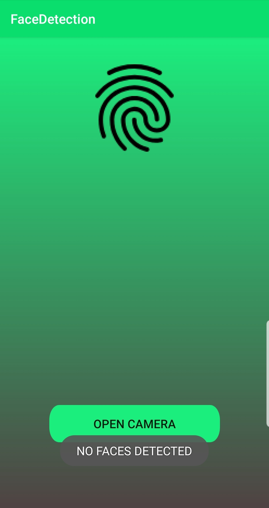
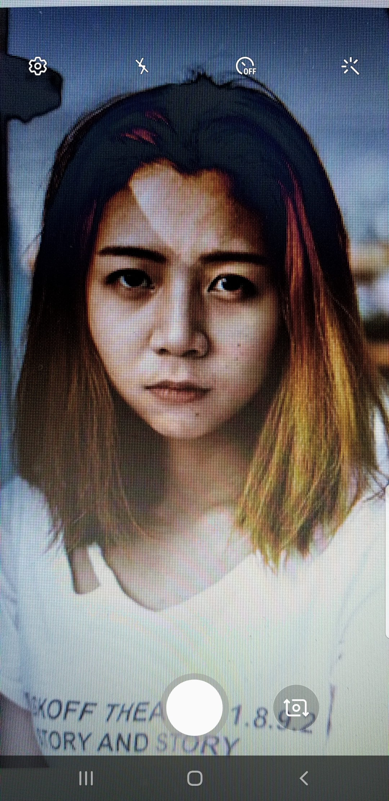
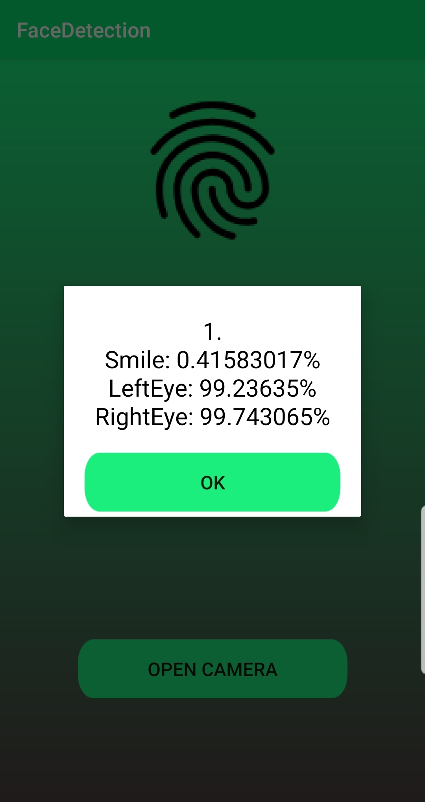
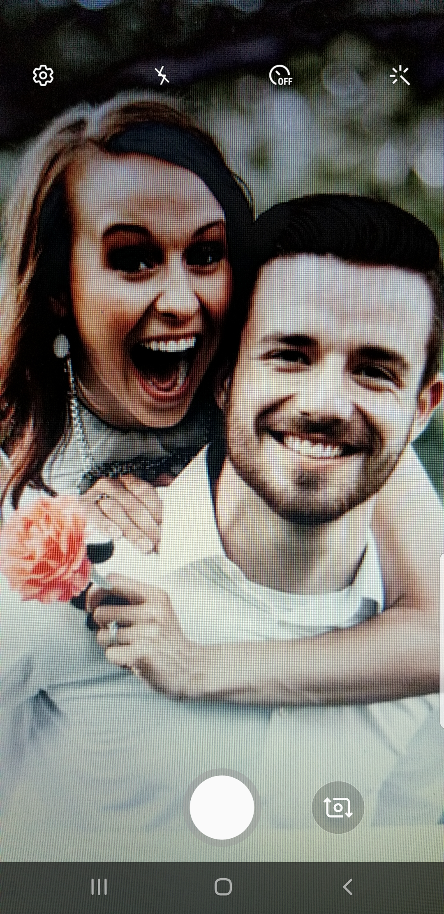
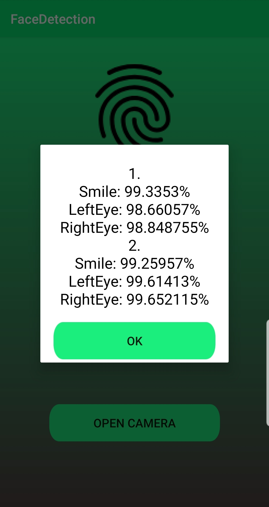
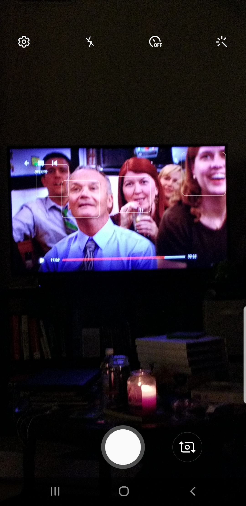
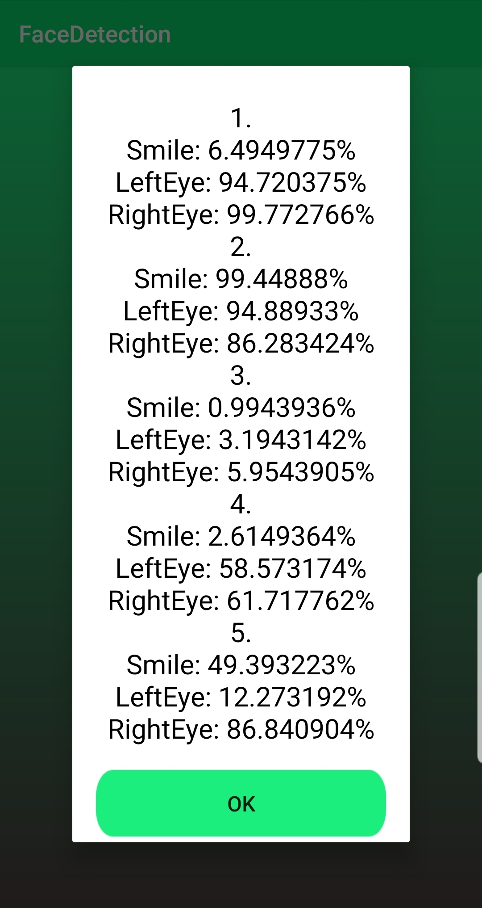

# FaceDetectionSmile
This is an app used to recognize faces and detect if the face is smiling.

[Now on the Google PlayStore!](https://play.google.com/store/apps/details?id=com.adamdejans.facedetectionsmile)

### Screenshots

<td></td>

#### Captured Image and Output
<table>
 <tr>
  <th>Original Image</th>
  <th>Output</th>
 </tr>
 <tr>
  <td></td>
  <td></td>
 </tr>
 <tr>
  <th>Original Image</th>
  <th>Output</th>
 </tr>
 <tr>
  <td></td>
  <td></td>
 </tr>
  <tr>
  <th>Original Image</th>
  <th>Output</th>
 </tr>
 <tr>
  <td></td>
  <td></td>
 </tr>
 <tr>
  <th>Original Image</th>
  <th>Output</th>
 </tr>
 <tr>
  <td></td>
  <td></td>
 </tr>
</table>

### Notes
 - Implemented using Firebase ML Model
   - `firebase-ml-vision:17.0.0`
 
##### Other References
 - https://firebase.google.com/docs/ml-kit/detect-faces
